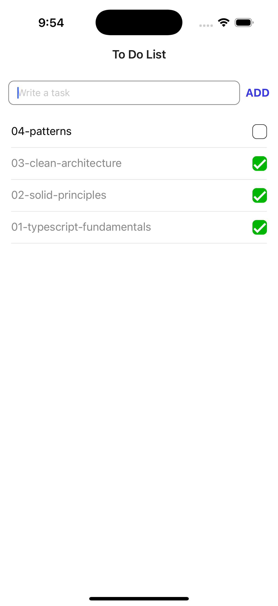

# React Native Architecture & Patterns — Learning & ToDo App


---

## 📖 Description / Descripción

**English:**  
Personal repo to learn and document how to build better React Native apps with Expo & TypeScript, functional programming, OOP, SOLID principles, Clean Architecture, and design patterns — with a hands-on ToDo app to put theory into practice.

**Español:**  
Repositorio personal para aprender y documentar cómo construir mejores aplicaciones en React Native usando Expo & TypeScript, programación funcional, POO, principios SOLID, Arquitectura Limpia y patrones de diseño — con una aplicación práctica de tareas (ToDo) para aplicar lo aprendido.

---

## 📁 Contents / Contenido

**English:**  
This repository is organized into two main parts:

- 📱 **React Native App (root directory):** A practical ToDo app built with React Native. It applies the concepts from the [learning/](learning/README.md) section and explores advanced topics like environment configuration (*flavors* for dev and prod).
- 📚 `learning/`: A structured collection of foundational concepts, examples, and patterns — including TypeScript basics, functional programming, OOP, SOLID, Clean Architecture, and design patterns.

**Español:**  
Este repositorio está organizado en dos partes principales:

- 📱 **Aplicación React Native (directorio raíz):** Una app práctica de tareas (ToDo) construida con React Native. Aplica los conceptos vistos en la carpeta [learning/](learning/README.md) y explora temas avanzados como configuración de entornos (*flavors* para desarrollo y producción).
- 📚 `learning/`: Una colección estructurada de conceptos fundamentales, ejemplos y patrones — incluyendo fundamentos de TypeScript, programación funcional, POO, principios SOLID, Arquitectura Limpia y patrones de diseño.

## To Do App

<p align="center">
  
</p>

### Required Software / Software Requerido
- [Node](https://nodejs.org/es) (18.x or higher)
- [Bun](https://bun.sh/)
- [Expo Go (for testing on physical devices)](https://expo.dev/go?sdkVersion=51&platform=android&device=true)
- [Xcode (for iOS development)](https://developer.apple.com/documentation/safari-developer-tools/installing-xcode-and-simulators)
- [Android Studio (for Android development)](https://developer.android.com/studio)
- iOS Simulator or Android Emulator

### Installation Guide / Guía de Instalación
#### 1. Environment Setup

[Install NVM (Node Version Manager)](https://github.com/nvm-sh/nvm?tab=readme-ov-file#installing-and-updating):

```
# Using nvm (recommended)
curl -o- https://raw.githubusercontent.com/nvm-sh/nvm/v0.40.3/install.sh | bash

# Restart your terminal and install Node.js
nvm install 18.17.1
nvm use 18.17.1

# Verify installation
node --version
```

Install Bun 

For more detailed installation instructions (npm , homebrew, etc) and troubleshooting, visit the Bun [Installation Guide](https://bun.sh/docs/installation)

(macOS & Linux):

```
# for macOS, Linux
curl -fsSL https://bun.sh/install | bash -s "bun-v1.2.9"
```

#### 2. Project Setup
Clone and install:

```
git clone https://github.com/AndreSubia/react-native-architecture-patterns
cd react-native-architecture-patterns
bun install
```
#### 3. Running the Application
```
# Start the development server
bun start

# Run on iOS simulator
bun ios

# Run on Android emulator
bun android
```
### Development Scripts
```
# Format code
bun format

# Lint code
bun lint

# Type checking
bun check
```

### Project Structure

```txt
app/
├── _layout.tsx    # Stack navigation configuration
└── index.tsx      # Entry point, renders TaskListScreen

src/
├── data/                  # Data Layer
│   ├── local/             # Local storage implementation
│   │   └── AsyncStorageTaskRepository.ts
│   └── remote/            # Remote storage implementation
│       └── SupabaseTaskRepository.ts
│
├── domain/               # Business Logic Layer
│   ├── entities/         # Core business models
│   │   └── Task.ts
│   ├── repositories/     # Data contracts
│   │   └── TaskRepository.ts
│   └── use-cases/        # Business operations
│       ├── createTask.ts
│       ├── getAllTasks.ts
│       └── toggleTaskStatus.ts
│
└── presentation/         # UI Layer
    ├── components/       # UI Components (Atomic Design)
    │   ├── atoms/        # Basic components
    │   ├── molecules/    # Composite components
    │   │   ├── TaskInput.tsx
    │   │   └── TaskItem.tsx
    │   └── organisms/    # Complex components
    │       └── TaskList.tsx
    ├── controller/       # UI Logic
    │   └── useTasks.ts
    ├── screens/          # App Screens
    │   └── TaskListScreen.tsx
    └── theme/            # UI Constants
        └── colors.ts
```
