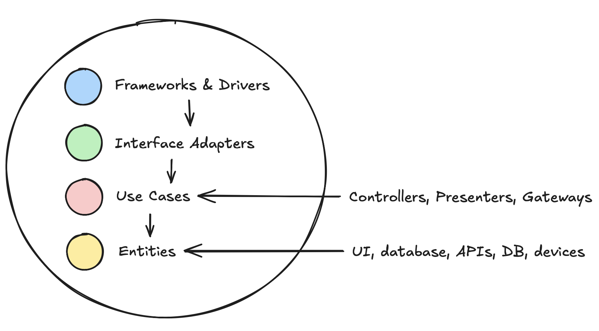

# 🧱 Clean Architecture in React Native

## ✅ Overview

Clean Architecture is a software design philosophy that separates code into layers of responsibility, making it **scalable**, **testable**, and **maintainable**.

Each layer depends only on the inner layers, keeping the **core business logic isolated** from frameworks and infrastructure.

---

## 🔄 Main Layers

1. **Entities**  
   Core business models and logic. They are **pure TypeScript** and don't depend on frameworks.

2. **Use Cases**  
   Application-specific business rules. They coordinate entities and execute logic for a particular feature.

3. **Interface Adapters**  
   Translate data between the domain and external systems (UI, APIs, storage). React Native components live here.

4. **Frameworks & Drivers**  
   Infrastructure code like databases, HTTP clients, device APIs, etc.

---

## 💡 Benefits

- Clear **separation of concerns**  
- Easy to **test**, **replace technologies**, or **scale**
- Business rules remain untouched by UI or framework changes

---

# 🧱 Arquitectura Limpia en React Native

## ✅ Descripción general

La Arquitectura Limpia es una filosofía de diseño de software que separa el código en capas de responsabilidad, haciéndolo **escalable**, **testeable** y **mantenible**.

Cada capa depende solo de las capas internas, manteniendo la **lógica de negocio central aislada** de frameworks e infraestructura.

---

## 🔄 Capas principales

1. **Entidades**  
   Modelos y lógica de negocio central. Son **TypeScript puro**, sin depender de frameworks.

2. **Casos de Uso**  
   Reglas de negocio específicas de la aplicación. Coordinan entidades y ejecutan lógica para una funcionalidad.

3. **Adaptadores de interfaz**  
   Traducen datos entre el dominio y sistemas externos (UI, APIs, almacenamiento). Aquí vive React Native.

4. **Frameworks e Infraestructura**  
   Código de infraestructura como bases de datos, clientes HTTP, APIs del dispositivo, etc.

---

## 💡 Beneficios

- Clara **separación de responsabilidades**  
- Fácil de **probar**, **cambiar tecnología** o **escalar**  
- Las reglas de negocio no se ven afectadas por cambios de UI o framework
